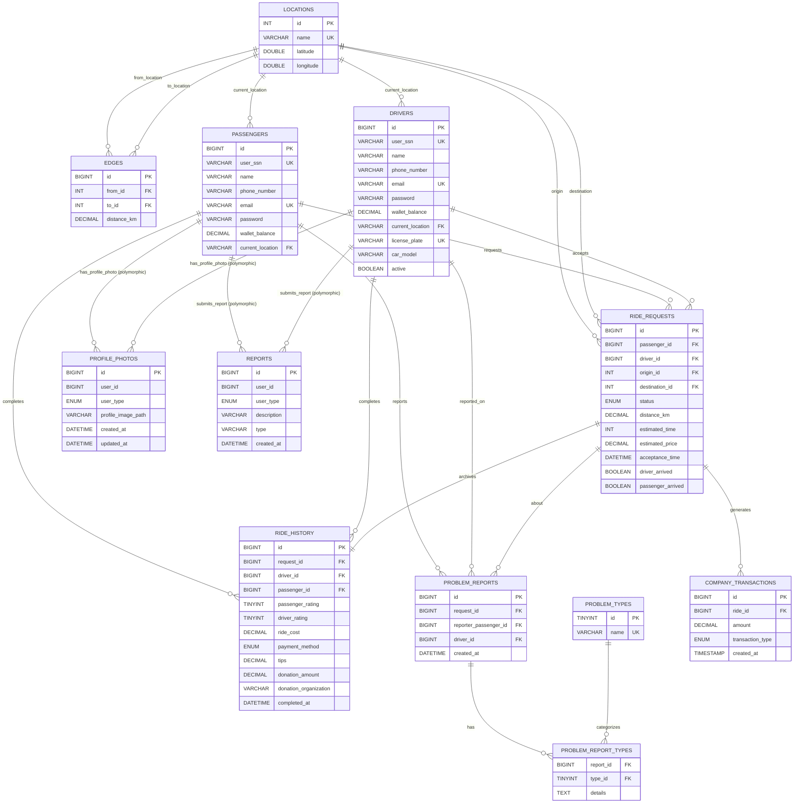

# MiniGo – Ride-Hailing Application

MiniGo is a comprehensive ride-hailing application developed in Java, designed to connect passengers with drivers for efficient and safe transportation. The system provides real-time ride matching, route optimization, payment processing, and a complete ride management workflow.

---

## 📋 Table of Contents

- [Features](#-features)
- [Project Workflow](#-project-workflow)
- [System Architecture](#-system-architecture)
- [Database Design](#-database-design)
- [ER Diagram](#-er-diagram)
- [UML Diagram](#-uml-diagram)
- [Tools & Technologies](#-tools--technologies)
- [Usage](#-usage)
- [Project Structure](#-project-structure)

---

## ✨ Features

### Passenger Features
- **User Registration & Authentication** – Secure account creation and login system
- **Real-time Ride Requests** – Request rides with origin and destination selection
- **Interactive Map View** – Visual representation of locations and routes using OpenLayers
- **Route Optimization** – Shortest path calculation using Dijkstra's algorithm
- **Digital Wallet** – Manage wallet balance and add funds for ride payments
- **Ride History** – View completed rides with detailed information
- **Driver Rating System** – Rate drivers after each ride to maintain quality
- **Live Chat** – Communicate with drivers during rides
- **Problem Reporting** – Report issues with rides or drivers
- **PDF Invoice Generation** – Automatic invoice generation for completed rides
- **Profile Management** – Update personal information and profile photos

### Driver Features
- **Driver Dashboard** – Overview of ride requests and earnings
- **Ride Acceptance System** – Accept or decline ride requests
- **Real-time Navigation** – Interactive map showing pickup and drop-off locations
- **Earnings Tracking** – Monitor income from completed rides
- **Passenger Rating** – Rate passengers after ride completion
- **Profile & Vehicle Management** – Manage driver and vehicle information
- **Status Control** – Toggle availability status (active/inactive)

### System Features
- **Concurrent Request Handling** – Multithreading support for multiple simultaneous ride requests
- **Email Notifications** – Automated email service for important events and confirmations
- **Donation System** – Optional charitable contributions during payment
- **Tips System** – Passengers can tip drivers for excellent service
- **Transaction Management** – Complete financial transaction tracking for the company
- **Problem Type Classification** – Structured reporting system with predefined problem categories

---

## 🔄 Project Workflow

MiniGo follows a complete ride lifecycle from request to completion. Here's how the system operates:

### **1. Passenger Requests a Ride**
- Passenger logs into the application
- Selects origin and destination from available locations
- System displays the selected route on an interactive map

### **2. Route Calculation (Dijkstra's Algorithm)**
- The system models locations as a weighted graph (nodes = locations, edges = roads)
- Dijkstra's shortest path algorithm calculates the optimal route
- Estimated distance, travel time, and fare are computed
- Route visualization is displayed to the passenger

### **3. Ride Request Creation**
- A new ride request is created with status "Pending"
- Request details are saved to the database (`ride_requests` table)
- The request becomes available to active drivers in the system

### **4. Driver Assignment**
- Active drivers receive notifications of pending ride requests
- A driver reviews the request details (pickup location, destination, fare)
- Driver accepts the ride request

### **5. Ride Acceptance & Notification**
- Ride status changes from "Pending" to "Accepted"
- Passenger receives notification with driver information (name, vehicle details)
- Email confirmation is sent to the passenger
- Both parties can access a live chat for communication

### **6. Pickup Process**
- Driver navigates to the passenger's location using the map interface
- Driver marks arrival at pickup location
- Passenger confirms boarding
- Ride officially begins

### **7. Journey in Progress**
- Real-time tracking is available for both passenger and driver
- Live chat remains active for communication
- Driver follows the calculated route to the destination

### **8. Ride Completion**
- Driver arrives at the destination
- Driver marks the ride as completed
- System records completion timestamp

### **9. Payment Processing**
- Ride cost is automatically deducted from passenger's digital wallet
- Driver's wallet balance is credited with the fare amount
- Company transaction fee is recorded in `company_transactions` table
- Transaction details are stored for auditing

### **10. Rating & Feedback**
- Passenger rates the driver (1-5 stars)
- Driver rates the passenger (1-5 stars)
- Optional: Passenger can add a tip for the driver
- Optional: Passenger can donate to a charitable organization
- Ratings are saved to `ride_history` table

### **11. Invoice Generation**
- System automatically generates a PDF invoice using iText library
- Invoice includes ride details, fare breakdown, payment method, tips, and donations
- Invoice is saved to `resources/invoices/` directory
- Email notification with ride summary is sent to the passenger

### **12. Post-Ride Options**
- Passenger can view ride history and download past invoices
- Passenger can report problems with the ride or driver
- Both users can update their profiles and settings

### **Error Handling & Edge Cases**
- **Ride Cancellation**: Passenger can cancel before driver acceptance (cancellation fee may apply)
- **Driver Unavailability**: If no driver accepts within a timeframe, request expires
- **Payment Failure**: Ride cannot be requested if wallet balance is insufficient
- **Problem Reporting**: Structured reporting system for ride issues

This workflow ensures a smooth, transparent, and reliable ride-hailing experience for all users.

---

## 🏗 System Architecture

MiniGo implements a **layered MVC (Model-View-Controller) architecture** with clear separation between presentation, business logic, and data access layers. This design ensures maintainability, testability, and scalability.

### **Architecture Overview**

```
┌──────────────────────────────────────────────────────────┐
│              PRESENTATION LAYER (MVC)                     │
│                                                           │
│  ┌─────────────────┐         ┌─────────────────┐        │
│  │  VIEW (FXML)    │  ←───→  │  CONTROLLER     │        │
│  │  - MapView.fxml │         │  - MapController│        │
│  │  - Login.fxml   │         │  - LoginCtrl    │        │
│  │  - Dashboard    │         │  - DashboardCtrl│        │
│  └─────────────────┘         └────────┬────────┘        │
│                                        │                  │
│                    User Interaction    │                  │
│                    ↕                   │ Calls Services   │
└────────────────────────────────────────┼──────────────────┘
                                         ↓
┌────────────────────────────────────────────────────────┐
│         SERVICE LAYER (MODEL - Business Logic)         │
│                                                         │
│  - RideManager.java      → Orchestrates ride workflow  │
│  - MapGraph.java         → Dijkstra's algorithm        │
│  - Payment.java          → Wallet & fare calculations  │
│  - Request.java          → Ride state management       │
│                                                         │
│  Responsibilities:                                      │
│  ✓ Apply business rules and validations                │
│  ✓ Coordinate between multiple DAOs                    │
│  ✓ Execute algorithms (routing, pricing)               │
│  ✓ Never contain SQL or UI code                        │
└─────────────────────────┬──────────────────────────────┘
                          ↓
┌────────────────────────────────────────────────────────┐
│           DAO LAYER (Data Access Object)               │
│                                                         │
│  - PassengerDAO      ↔  passengers table               │
│  - DriverDAO         ↔  drivers table                  │
│  - RideRequestDAO    ↔  ride_requests table            │
│  - RideHistoryDAO    ↔  ride_history table             │
│  - LocationDAO       ↔  locations table                │
│  - EdgeDAO           ↔  edges table                    │
│  - ProfilePhotoDAO   ↔  profile_photos table           │
│                                                         │
│  Responsibilities:                                      │
│  ✓ Execute SQL queries (SELECT, INSERT, UPDATE, etc.)  │
│  ✓ Map database ResultSets to Java objects             │
│  ✓ Use PreparedStatements (prevent SQL injection)      │
│  ✓ Only layer that communicates with database          │
└─────────────────────────┬──────────────────────────────┘
                          ↓
┌────────────────────────────────────────────────────────┐
│              DATABASE LAYER (MySQL)                     │
│                                                         │
│  Tables: passengers, drivers, ride_requests,           │
│          ride_history, locations, edges,               │
│          profile_photos, reports, etc.                 │
│                                                         │
│  Enforces:                                              │
│  ✓ Primary Keys (PK)                                   │
│  ✓ Foreign Keys (FK) with CASCADE rules                │
│  ✓ UNIQUE constraints (emails, SSNs)                   │
│  ✓ CHECK constraints (ratings, distances)              │
└────────────────────────────────────────────────────────┘
```
---

#### **Real Example: Requesting a Ride**

Let's trace a complete ride request through all MVC components:

**STEP 1: User Interaction (VIEW)**
```xml
<!-- MapView.fxml -->
<ComboBox fx:id="originComboBox" />
<ComboBox fx:id="destinationComboBox" />
<Button fx:id="requestRideButton" 
        text="Request Ride" 
        onAction="#onRequestRideButtonClick" />
<Label fx:id="statusLabel" />
```

**What Happens**:
- User selects "Cairo" as origin
- User selects "Alexandria" as destination  
- User clicks "Request Ride" button
- Button's `onAction` triggers Controller method

---

**STEP 2: Event Handling (CONTROLLER)**
```java
// MapController.java
@FXML
public void onRequestRideButtonClick() {
    // Get data from View
    Location origin = originComboBox.getValue();
    Location destination = destinationComboBox.getValue();
    
    // Input validation (Controller responsibility)
    if (origin == null || destination == null) {
        statusLabel.setText("Error: Select both locations");
        showAlert("Validation Error", "Please select origin and destination");
        return;
    }
    
    if (origin.equals(destination)) {
        showAlert("Invalid", "Origin and destination must be different");
        return;
    }
    
    // Check balance (preliminary check)
    if (currentPassenger.getWalletBalance() < 10) {
        showAlert("Insufficient Balance", "Minimum balance required: 10 EGP");
        return;
    }
    
    // Call Model
    try {
        statusLabel.setText("Processing request...");
        RideRequest request = rideManager.createRideRequest(
            currentPassenger, origin, destination
        );
        
        // Update View with success
        handleRideRequestSuccess(request);
        
    } catch (InsufficientBalanceException e) {
        statusLabel.setText("Error: Insufficient balance");
        showAlert("Balance Error", e.getMessage());
    } catch (NoRouteFoundException e) {
        statusLabel.setText("Error: No route available");
        showAlert("Route Error", "No route found between these locations");
    } catch (Exception e) {
        statusLabel.setText("Error: Request failed");
        showAlert("Error", "Failed to create ride request");
    }
}

private void handleRideRequestSuccess(RideRequest request) {
    statusLabel.setText("Ride requested! Waiting for driver...");
    
    // Display ride details in UI
    distanceLabel.setText(String.format("%.2f km", request.getDistance()));
    fareLabel.setText(String.format("%.2f EGP", request.getEstimatedPrice()));
    timeLabel.setText(String.format("%d min", request.getEstimatedTime()));
    
    // Disable request button
    requestRideButton.setDisable(true);
    
    // Show confirmation dialog
    showConfirmation("Success", "Ride request created successfully!");
}
```

**Controller Responsibilities**:
- ✅ Gets origin "Cairo" and destination "Alexandria" from ComboBoxes
- ✅ Validates: both selected, different from each other
- ✅ Validates: passenger has minimum balance
- ✅ Calls `rideManager.createRideRequest()`
- ✅ Handles exceptions
- ✅ Updates UI labels with ride details
- ✅ Disables button to prevent duplicate requests

---

**STEP 3: Business Logic (MODEL - Service Layer)**
```java
// RideManager.java
public RideRequest createRideRequest(Passenger passenger, 
                                     Location origin, 
                                     Location destination) {
    
    // BUSINESS RULE 1: Calculate optimal route using Dijkstra
    MapGraph graph = new MapGraph();
    graph.loadFromDatabase(); // Loads locations and edges
    
    List<Location> route = graph.calculateShortestPath(
        origin.getName(), 
        destination.getName()
    );
    
    if (route == null || route.isEmpty()) {
        throw new NoRouteFoundException("No route exists between locations");
    }
    
    // Calculate total distance
    double totalDistance = 0.0;
    for (int i = 0; i < route.size() - 1; i++) {
        Edge edge = edgeDAO.findBetween(route.get(i), route.get(i + 1));
        totalDistance += edge.getDistanceKm();
    }
    
    // BUSINESS RULE 2: Calculate fare
    double baseFare = 10.0;        // Base charge
    double pricePerKm = 2.5;       // Per kilometer
    double estimatedFare = baseFare + (totalDistance * pricePerKm);
    
    // BUSINESS RULE 3: Validate passenger can afford ride
    if (passenger.getWalletBalance() < estimatedFare) {
        throw new InsufficientBalanceException(
            String.format("Required: %.2f EGP, Available: %.2f EGP", 
                         estimatedFare, passenger.getWalletBalance())
        );
    }
    
    // BUSINESS RULE 4: Calculate estimated travel time
    double averageSpeed = 60.0; // km/h
    int estimatedMinutes = (int) ((totalDistance / averageSpeed) * 60);
    
    // BUSINESS RULE 5: Create ride request object
    RideRequest request = new RideRequest();
    request.setPassengerId(passenger.getId());
    request.setOriginId(origin.getId());
    request.setDestinationId(destination.getId());
    request.setDistance(totalDistance);
    request.setEstimatedPrice(estimatedFare);
    request.setEstimatedTime(estimatedMinutes);
    request.setStatus("Pending");
    request.setCreatedAt(LocalDateTime.now());
    
    // BUSINESS RULE 6: Save to database via DAO
    rideRequestDAO.insert(request);
    
    // BUSINESS RULE 7: Send notification email
    emailService.sendRideConfirmation(passenger.getEmail(), request);
    
    // Return created request
    return request;
}
```

**Model Responsibilities**:
- ✅ Calculates shortest path: Cairo → Giza → Fayoum → Minya → Asyut → Sohag → Alexandria
- ✅ Calculates total distance: 220.5 km
- ✅ Calculates fare: 10 + (220.5 × 2.5) = 561.25 EGP
- ✅ Validates passenger balance: 800 EGP (sufficient ✓)
- ✅ Calculates travel time: (220.5 / 60) × 60 = 220 minutes
- ✅ Creates RideRequest object with all calculated data
- ✅ Calls DAO to save request
- ✅ Sends confirmation email

---

**STEP 4: Data Persistence (DAO Layer)**
```java
// RideRequestDAO.java
public void insert(RideRequest request) {
    String sql = "INSERT INTO ride_requests " +
                 "(passenger_id, origin_id, destination_id, status, " +
                 "distance_km, estimated_time, estimated_price, created_at) " +
                 "VALUES (?, ?, ?, ?, ?, ?, ?, ?)";
    
    try (Connection conn = DatabaseConnection.getConnection();
         PreparedStatement stmt = conn.prepareStatement(sql, 
                                  Statement.RETURN_GENERATED_KEYS)) {
        
        stmt.setLong(1, request.getPassengerId());      // 101
        stmt.setInt(2, request.getOriginId());          // 1 (Cairo)
        stmt.setInt(3, request.getDestinationId());     // 5 (Alexandria)
        stmt.setString(4, request.getStatus());         // "Pending"
        stmt.setDouble(5, request.getDistance());       // 220.5
        stmt.setInt(6, request.getEstimatedTime());     // 220
        stmt.setDouble(7, request.getEstimatedPrice()); // 561.25
        stmt.setTimestamp(8, Timestamp.valueOf(request.getCreatedAt()));
        
        int rowsAffected = stmt.executeUpdate();
        
        if (rowsAffected > 0) {
            // Get generated ID
            ResultSet rs = stmt.getGeneratedKeys();
            if (rs.next()) {
                request.setId(rs.getLong(1)); // Set ID: 2053
            }
        }
        
    } catch (SQLException e) {
        throw new DatabaseException("Failed to insert ride request", e);
    }
}
```

**DAO Responsibilities**:
- ✅ Converts RideRequest object to SQL INSERT statement
- ✅ Uses PreparedStatement (prevents SQL injection)
- ✅ Executes query: Inserts record into `ride_requests` table
- ✅ Retrieves generated ID: 2053
- ✅ Updates request object with database ID
- ✅ Returns control to Service layer

---

**STEP 5: Database Storage**
```sql
-- MySQL Database executes:
INSERT INTO ride_requests 
(passenger_id, origin_id, destination_id, status, distance_km, 
 estimated_time, estimated_price, created_at)
VALUES 
(101, 1, 5, 'Pending', 220.5, 220, 561.25, '2025-12-17 14:30:00');

-- Record created with auto-generated id = 2053
```

---

**STEP 6: Return Flow (Back to User)**

```
DATABASE     →  Confirms insert, returns ID: 2053
    ↓
DAO          →  Returns RideRequest with id=2053
    ↓
MODEL        →  Returns complete RideRequest to Controller
    ↓
CONTROLLER   →  Receives RideRequest object
    ↓
CONTROLLER   →  Updates View:
                - statusLabel: "Ride requested! Waiting for driver..."
                - distanceLabel: "220.5 km"
                - fareLabel: "561.25 EGP"
                - timeLabel: "220 min"
                - Disables requestRideButton
    ↓
VIEW         →  User sees confirmation message and ride details
```

---

### **MVC Separation Summary**

| Component | What It Knows | What It Does | What It Doesn't Do |
|-----------|---------------|--------------|-------------------|
| **VIEW** | UI structure, styling | Displays data, captures clicks | ❌ No calculations<br>❌ No database<br>❌ No logic |
| **CONTROLLER** | View references, Service references | Validates input, orchestrates flow, updates UI | ❌ No business rules<br>❌ No SQL<br>❌ No algorithms |
| **MODEL (Service)** | Business rules, algorithms | Calculates, validates, coordinates | ❌ No UI updates<br>❌ No SQL<br>❌ No user interaction |
| **MODEL (Entity)** | Data structure | Stores data, getters/setters | ❌ No logic<br>❌ No database<br>❌ No UI |
| **DAO** | SQL, database schema | Executes queries, maps data | ❌ No business logic<br>❌ No UI<br>❌ No validation |

---

### **Why This Separation Matters**

**Benefit 1: Easy Maintenance**
- Bug in fare calculation? → Fix `RideManager.java` (Model)
- Change button text? → Edit `MapView.fxml` (View)
- Update validation? → Modify `MapController.java` (Controller)

**Benefit 2: Independent Testing**
- Test Model without UI: Mock Controller, test `RideManager` directly
- Test Controller without database: Mock Service layer
- Test DAO without business logic: Test SQL queries in isolation

**Benefit 3: Parallel Development**
- UI designer works on FXML (View)
- Backend developer codes Service layer (Model)
- Database developer writes DAOs
- No conflicts!

**Benefit 4: Reusability**
- Same Model logic used by passenger app, driver app, admin panel
- Change from JavaFX to web UI? → Replace View + Controller, keep Model + DAO

**Benefit 5: Security**
- Only DAO layer accesses database → Easy to secure
- Only Model layer has business rules → Easy to protect intellectual property
- UI can't bypass validations → Data integrity guaranteed

### **Layer Responsibilities in Detail**

#### **1. Presentation Layer: View + Controller (MVC)**

This layer implements the **View** and **Controller** components of the MVC pattern.

**View (FXML Files) – The User Interface**
- Define UI structure declaratively using XML
- Display data to the user
- Capture user interactions (clicks, text input)
- Located in `resources/` directory
- Styled using CSS (e.g., `style.css`, `driver-dialog.css`)
- **Examples**: 
  - `MapView.fxml` – Interactive map interface
  - Login/registration forms
  - Passenger/driver dashboards

**Responsibilities**:
- ✅ Display information to users
- ✅ Bind UI components to controller methods
- ❌ NO business logic
- ❌ NO database access
- ❌ NO calculations

---

**Controller (JavaFX Controller Classes) – The Traffic Director**
- Act as intermediaries between View and Model
- Handle user events triggered by the View
- Validate user input (null checks, format validation)
- Call Service layer methods to perform operations
- Receive results and update the View accordingly
- **Examples**: 
  - `MapController.java` – Handles ride request interactions
  - `LoginController.java` – Manages authentication flow
  - `DriverDashboardController.java` – Controls driver interface

**Typical Controller Method Flow**:
```java
@FXML
public void onRequestRideButtonClick() {
    // 1. Get data from View
    Location origin = originComboBox.getValue();
    Location destination = destinationComboBox.getValue();
    
    // 2. Validate input
    if (origin == null || destination == null) {
        showAlert("Please select both origin and destination");
        return;
    }
    
    // 3. Call Service layer
    RideRequest request = rideManager.createRideRequest(
        passenger, origin, destination
    );
    
    // 4. Update View based on result
    if (request != null) {
        showConfirmation("Ride request created successfully!");
    } else {
        showAlert("Failed to create ride request");
    }
}
```

**Responsibilities**:
- ✅ Capture user actions
- ✅ Validate input data
- ✅ Call Service layer methods
- ✅ Update UI components
- ❌ NO business calculations
- ❌ NO database access
- ❌ NO SQL queries

**Key Principle**: Controllers orchestrate the flow but delegate actual work to the Service layer.

---

#### **2. Service Layer: Business Logic (Model)**

This layer represents the **Model** component of the MVC pattern—the brain of the application.

**Purpose**: Contains all business rules, algorithms, and application logic.

**Key Service Classes**:

**RideManager.java – Ride Lifecycle Orchestrator**
- Creates and manages ride requests
- Coordinates between passengers and drivers
- Handles ride state transitions (Pending → Accepted → Completed)
- Manages concurrent ride requests using multithreading
- Coordinates multiple DAOs to complete operations
- **Example**: When creating a ride, it validates passenger balance, checks driver availability, and saves the request

**MapGraph.java – Routing Engine**
- Builds a weighted graph from locations and edges
- Implements **Dijkstra's shortest path algorithm**
- Calculates optimal routes between any two locations
- Computes distance, travel time, and fare estimates
- **Example**: Given origin "Cairo" and destination "Alexandria", calculates the shortest path through intermediate cities

**Payment.java – Financial Manager**
- Validates wallet balance before rides
- Processes fare deductions from passengers
- Credits driver wallets after ride completion
- Records company transaction fees
- Handles tips and donations
- **Example**: Deducts 50 EGP from passenger wallet, adds 45 EGP to driver wallet, logs 5 EGP company fee

**Request.java – Ride State Manager**
- Manages ride request lifecycle
- Validates ride request data
- Handles driver assignment logic
- Processes ride cancellations
- Updates ride status
- **Example**: Validates that passenger has sufficient balance before creating a request

**Responsibilities**:
- ✅ Apply business rules and validations
- ✅ Execute algorithms (routing, pricing)
- ✅ Coordinate between multiple DAOs
- ✅ Perform calculations and data transformations
- ✅ Enforce application constraints
- ❌ NO direct database access (uses DAOs)
- ❌ NO UI code or JavaFX components
- ❌ NO SQL queries

**Example Service Method**:
```java
public RideRequest createRideRequest(Passenger passenger, 
                                     Location origin, 
                                     Location destination) {
    // Business Rule 1: Validate balance
    double estimatedFare = calculateFare(origin, destination);
    if (passenger.getWalletBalance() < estimatedFare) {
        throw new InsufficientBalanceException();
    }
    
    // Business Rule 2: Calculate route using Dijkstra
    List<Location> route = mapGraph.shortestPath(origin, destination);
    double distance = calculateDistance(route);
    
    // Business Rule 3: Create request
    RideRequest request = new RideRequest();
    request.setPassenger(passenger);
    request.setOrigin(origin);
    request.setDestination(destination);
    request.setDistance(distance);
    request.setEstimatedPrice(estimatedFare);
    request.setStatus("Pending");
    
    // DAO Interaction: Save to database
    rideRequestDAO.insert(request);
    
    return request;
}
```

**Key Principle**: Services contain the "what" and "why" of the application—what should happen and why it should happen that way.

---

#### **3. DAO Layer: Data Access Object**

The DAO pattern provides a clean abstraction for all database operations, isolating SQL code from business logic.

**Purpose**: Act as the bridge between the application and the database.

**DAO Mapping (One DAO per Table)**:

| DAO Class | Database Table | Responsibility |
|-----------|---------------|----------------|
| `PassengerDAO.java` | `passengers` | CRUD operations for passenger accounts |
| `DriverDAO.java` | `drivers` | CRUD operations for driver accounts |
| `RideRequestDAO.java` | `ride_requests` | Manage ride requests lifecycle |
| `RideHistoryDAO.java` | `ride_history` | Archive completed rides |
| `LocationDAO.java` | `locations` | Manage map locations |
| `EdgeDAO.java` | `edges` | Manage road connections |
| `ProfilePhotoDAO.java` | `profile_photos` | Store user profile images |
| `ReportDAO.java` | `reports` | Handle user issue reports |
| `ProblemReportDAO.java` | `problem_reports` | Manage ride problem reports |

**Core DAO Operations**:
- **Create**: Insert new records into the database
- **Read**: Retrieve records by ID, email, or other criteria
- **Update**: Modify existing records
- **Delete**: Remove records from the database

**Example DAO Methods**:
```java
public class PassengerDAO {
    // Find passenger by email
    public Passenger findByEmail(String email) {
        String sql = "SELECT * FROM passengers WHERE email = ?";
        // Execute query using PreparedStatement
        // Map ResultSet to Passenger object
        // Return passenger
    }
    
    // Update wallet balance
    public void updateWalletBalance(long passengerId, double newBalance) {
        String sql = "UPDATE passengers SET wallet_balance = ? WHERE id = ?";
        // Execute update using PreparedStatement
    }
    
    // Insert new passenger
    public void insert(Passenger passenger) {
        String sql = "INSERT INTO passengers (name, email, password, ...) VALUES (?, ?, ?, ...)";
        // Execute insert using PreparedStatement
    }
}
```

**How DAOs Work**:

1. **Service calls DAO method**:
   ```java
   Passenger passenger = passengerDAO.findByEmail("user@example.com");
   ```

2. **DAO executes SQL query**:
   ```java
   PreparedStatement stmt = connection.prepareStatement(
       "SELECT * FROM passengers WHERE email = ?"
   );
   stmt.setString(1, "user@example.com");
   ResultSet rs = stmt.executeQuery();
   ```

3. **DAO maps database results to Java objects**:
   ```java
   if (rs.next()) {
       Passenger passenger = new Passenger();
       passenger.setId(rs.getLong("id"));
       passenger.setName(rs.getString("name"));
       passenger.setEmail(rs.getString("email"));
       passenger.setWalletBalance(rs.getDouble("wallet_balance"));
       return passenger;
   }
   ```

4. **DAO returns object to Service layer**:
   ```java
   return passenger; // Service layer now has the passenger object
   ```

**Responsibilities**:
- ✅ Execute SQL queries (SELECT, INSERT, UPDATE, DELETE)
- ✅ Map `ResultSet` data to Java objects
- ✅ Use `PreparedStatement` to prevent SQL injection
- ✅ Manage database connections
- ✅ Handle SQL exceptions
- ❌ NO business logic or validations
- ❌ NO UI code
- ❌ NO direct calls from Controllers (always through Services)

**Key Principle**: DAOs are the **only** classes that contain SQL queries and communicate with the database. This isolation makes database changes easy—you only modify DAOs, not business logic.

---

#### **4. Model Layer: Data Entities**

Data models are simple Java classes (POJOs - Plain Old Java Objects) that represent database entities.

**Purpose**: Encapsulate data and provide a structured way to pass information between layers.

**Core Model Classes**:
- `Passenger.java` – Passenger account data
- `Driver.java` – Driver account and vehicle data
- `RideRequest.java` – Ride request information
- `RideHistory.java` – Completed ride details
- `Location.java` – Map location coordinates
- `Edge.java` – Road connection between locations
- `ProblemReport.java` – Ride issue reports
- `Report.java` – General user reports

**Typical Model Structure**:
```java
public class Passenger {
    // Fields matching database columns
    private Long id;
    private String name;
    private String email;
    private String phoneNumber;
    private double walletBalance;
    private String currentLocation;
    
    // Constructor
    public Passenger() { }
    
    // Getters and Setters
    public Long getId() { return id; }
    public void setId(Long id) { this.id = id; }
    
    public String getName() { return name; }
    public void setName(String name) { this.name = name; }
    
    // ... other getters and setters
    
    // Optional: Basic validation
    public boolean isValid() {
        return name != null && email != null && walletBalance >= 0;
    }
}
```

**Responsibilities**:
- ✅ Store data in structured fields
- ✅ Provide getters and setters for field access
- ✅ Basic field validation (optional)
- ✅ Represent database records as Java objects
- ❌ NO business logic
- ❌ NO database operations
- ❌ NO UI code

**Key Principle**: Models are "dumb" data containers—they hold information but don't perform operations.

---

### **Complete Data Flow: Requesting a Ride**

Let's trace how data flows through all layers when a passenger requests a ride:

**Step 1: User Interaction (View)**
```
Passenger opens MapView.fxml
Selects "Cairo" as origin
Selects "Alexandria" as destination
Clicks "Request Ride" button
```

**Step 2: Controller Captures Event**
```java
@FXML // MapController.java
public void onRequestRideButtonClick() {
    // Get data from View
    Location origin = originComboBox.getValue();     // Cairo
    Location destination = destinationComboBox.getValue(); // Alexandria
    
    // Validate input
    if (origin == null || destination == null) {
        showAlert("Please select both locations");
        return;
    }
    
    if (currentPassenger.getWalletBalance() < 10) {
        showAlert("Insufficient balance. Please add funds.");
        return;
    }
    
    // Call Service layer
    RideRequest request = rideManager.createRideRequest(
        currentPassenger, origin, destination
    );
    
    // Update View
    if (request != null) {
        showSuccess("Ride requested! Waiting for driver...");
        displayRideDetails(request);
    } else {
        showError("Failed to create ride request");
    }
}
```

**Step 3: Service Layer Processes Request**
```java
// RideManager.java (Service Layer)
public RideRequest createRideRequest(Passenger passenger, 
                                     Location origin, 
                                     Location destination) {
    
    // Business Rule 1: Calculate route using Dijkstra
    MapGraph graph = new MapGraph();
    List<Location> route = graph.calculateShortestPath(origin, destination);
    double distance = calculateTotalDistance(route);
    
    // Business Rule 2: Calculate fare
    double baseFare = 10.0;
    double farePerKm = 2.5;
    double estimatedFare = baseFare + (distance * farePerKm);
    
    // Business Rule 3: Validate passenger can afford the ride
    if (passenger.getWalletBalance() < estimatedFare) {
        throw new InsufficientBalanceException("Not enough balance");
    }
    
    // Business Rule 4: Estimate travel time
    int estimatedTime = (int) (distance / 60.0 * 60); // Assume 60 km/h
    
    // Create request object
    RideRequest request = new RideRequest();
    request.setPassengerId(passenger.getId());
    request.setOriginId(origin.getId());
    request.setDestinationId(destination.getId());
    request.setDistance(distance);
    request.setEstimatedPrice(estimatedFare);
    request.setEstimatedTime(estimatedTime);
    request.setStatus("Pending");
    
    // Call DAO to save to database
    rideRequestDAO.insert(request);
    
    // Send email notification
    emailService.sendRideConfirmation(passenger.getEmail(), request);
    
    return request;
}
```

**Step 4: DAO Saves to Database**
```java
// RideRequestDAO.java (DAO Layer)
public void insert(RideRequest request) {
    String sql = "INSERT INTO ride_requests " +
                 "(passenger_id, origin_id, destination_id, status, " +
                 "distance_km, estimated_time, estimated_price) " +
                 "VALUES (?, ?, ?, ?, ?, ?, ?)";
    
    try (PreparedStatement stmt = connection.prepareStatement(sql)) {
        stmt.setLong(1, request.getPassengerId());
        stmt.setInt(2, request.getOriginId());
        stmt.setInt(3, request.getDestinationId());
        stmt.setString(4, request.getStatus());
        stmt.setDouble(5, request.getDistance());
        stmt.setInt(6, request.getEstimatedTime());
        stmt.setDouble(7, request.getEstimatedPrice());
        
        stmt.executeUpdate(); // SQL INSERT executed
        
        // Retrieve generated ID
        ResultSet rs = stmt.getGeneratedKeys();
        if (rs.next()) {
            request.setId(rs.getLong(1));
        }
    } catch (SQLException e) {
        throw new RuntimeException("Failed to insert ride request", e);
    }
}
```

**Step 5: Database Stores Data**
```sql
-- MySQL Database executes:
INSERT INTO ride_requests 
(passenger_id, origin_id, destination_id, status, distance_km, estimated_time, estimated_price)
VALUES (101, 1, 5, 'Pending', 220.5, 220, 561.25);

-- New record created with id = 2053
```

**Step 6: Return Flow (Database → View)**
```
Database  →  DAO returns RideRequest object with ID
    ↓
Service  →  Returns RideRequest to Controller
    ↓
Controller  →  Updates UI to show "Ride Requested!"
    ↓
View  →  Displays ride details and "Waiting for driver..." message
```

**Complete Flow Summary**:
1. **View**: User clicks "Request Ride" button
2. **Controller**: Validates input, calls `rideManager.createRideRequest()`
3. **Service**: Applies business rules (Dijkstra, fare calculation, validation)
4. **Service**: Calls `rideRequestDAO.insert()`
5. **DAO**: Executes SQL INSERT with PreparedStatement
6. **Database**: Stores the ride request record
7. **DAO**: Returns created RideRequest object
8. **Service**: Returns RideRequest to Controller
9. **Controller**: Updates View with success message
10. **View**: Displays confirmation to user

**Reverse Flow (Reading Data)**:
```
User wants to view ride history
    ↓
View → Controller.loadRideHistory()
    ↓
Service → rideHistoryDAO.findByPassengerId(passengerId)
    ↓
DAO → SELECT * FROM ride_history WHERE passenger_id = ?
    ↓
Database → Returns ResultSet
    ↓
DAO → Maps ResultSet to List<RideHistory> objects
    ↓
Service → Applies any filtering/sorting logic
    ↓
Controller → Receives List<RideHistory>
    ↓
View → Displays ride history in TableView
```

### **Architecture Benefits**

✅ **Separation of Concerns**: Each layer has a single, well-defined responsibility  
✅ **Maintainability**: Changes in one layer don't cascade to others  
✅ **Testability**: Layers can be unit tested independently with mock objects  
✅ **Scalability**: New features integrate cleanly without modifying core architecture  
✅ **Reusability**: Business logic is decoupled from UI and can be reused  
✅ **Security**: SQL injection prevention through DAO prepared statements

---

## 🗄 Database Design


The MiniGo database uses a **relational schema** designed to efficiently manage users, rides, locations, and transactions. The database ensures data integrity through foreign key constraints and supports complex queries for real-time ride matching and reporting.

### **Core Entities**

#### **Locations Table**
Stores all available locations (cities, landmarks, areas) with geographic coordinates. Acts as nodes in the map graph.
- **Primary Key**: `id`
- **Unique Constraint**: `name` (location names must be unique)
- **Attributes**: `name`, `latitude`, `longitude`

#### **Edges Table**
Represents road connections between locations, forming a weighted graph for route calculation.
- **Primary Key**: `id`
- **Foreign Keys**: `from_id`, `to_id` (reference `locations.id`)
- **Attributes**: `distance_km` (weight for Dijkstra's algorithm)

#### **Passengers Table**
Stores passenger account information and current state.
- **Primary Key**: `id`
- **Unique Constraints**: `user_ssn`, `email`
- **Foreign Key**: `current_location` (references `locations.name`)
- **Attributes**: `name`, `phone_number`, `email`, `password`, `wallet_balance`

#### **Drivers Table**
Stores driver account information, vehicle details, and availability status.
- **Primary Key**: `id`
- **Unique Constraints**: `user_ssn`, `license_plate`
- **Foreign Key**: `current_location` (references `locations.name`)
- **Attributes**: `name`, `phone_number`, `email`, `password`, `wallet_balance`, `car_model`, `active`

#### **Ride Requests Table**
Tracks all ride requests from creation to completion or cancellation.
- **Primary Key**: `id`
- **Foreign Keys**: 
  - `passenger_id` → `passengers(id)`
  - `driver_id` → `drivers(id)` (nullable until assigned)
  - `origin_id` → `locations(id)`
  - `destination_id` → `locations(id)`
- **Attributes**: `status`, `distance_km`, `estimated_time`, `estimated_price`, `acceptance_time`
- **Status Values**: 'Pending', 'Accepted', 'Cancelled', 'Completed'

#### **Ride History Table**
Archives completed rides with ratings, payment details, and optional tips/donations.
- **Primary Key**: `id`
- **Foreign Keys**: 
  - `request_id` → `ride_requests(id)`
  - `driver_id` → `drivers(id)`
  - `passenger_id` → `passengers(id)`
- **Attributes**: `passenger_rating`, `driver_rating`, `ride_cost`, `payment_method`, `tips`, `donation_amount`, `completed_at`

#### **Problem Reports Tables**
Two-table structure for flexible problem reporting:
- **problem_types**: Defines predefined problem categories (DRIVER_BEHAVIOR, RECKLESS_DRIVING, etc.)
- **problem_reports**: Main report record
- **problem_report_types**: Many-to-many relationship allowing multiple problem types per report

#### **Company Transactions Table**
Tracks all financial transactions for business analytics and accounting.
- **Primary Key**: `id`
- **Foreign Key**: `ride_id`
- **Attributes**: `amount`, `transaction_type`, `created_at`
- **Transaction Types**: 'COMPLETED', 'CANCELLED_BY_PASSENGER'

#### **Profile Photos Table**
Stores profile image paths using a **polymorphic association pattern**, allowing both passengers and drivers to have profile photos without table duplication.
- **Primary Key**: `id`
- **Unique Constraint**: `(user_id, user_type)`
- **Polymorphic Keys**: 
  - `user_id` – References either `passengers.id` or `drivers.id`
  - `user_type` – ENUM('PASSENGER', 'DRIVER') determining which table `user_id` refers to
- **Attributes**: `profile_image_path`, `created_at`, `updated_at`
- **Design Rationale**: This approach avoids creating separate `passenger_photos` and `driver_photos` tables, reducing redundancy and maintaining a single source of truth for profile images

#### **Reports Table**
Stores general app issue reports using a **polymorphic association pattern**, allowing both passengers and drivers to submit reports through a unified system.
- **Primary Key**: `id`
- **Polymorphic Keys**: 
  - `user_id` – References either `passengers.id` or `drivers.id`
  - `user_type` – ENUM('PASSENGER', 'DRIVER') determining which table `user_id` refers to
- **Attributes**: `type`, `description`, `created_at`
- **Design Rationale**: By using a polymorphic association, any user type can report issues without requiring separate report tables, improving maintainability and enabling future user type extensions

### **Key Relationships**

- **Passengers ↔ Locations**: Many-to-One (a passenger has one current location)
- **Drivers ↔ Locations**: Many-to-One (a driver has one current location)
- **Ride Requests ↔ Passengers**: Many-to-One (a passenger can have multiple requests)
- **Ride Requests ↔ Drivers**: Many-to-One (a driver can accept multiple requests)
- **Ride Requests ↔ Locations**: Two Many-to-One relationships (origin and destination)
- **Ride History ↔ Ride Requests**: One-to-One (each completed ride has one history record)
- **Problem Reports ↔ Problem Types**: Many-to-Many (a report can have multiple problem types)
- **Edges ↔ Locations**: Two Many-to-One relationships (forming a directed graph)

### **Polymorphic Associations**

MiniGo uses **polymorphic associations** for shared resources between passengers and drivers, specifically for Profile Photos and Reports. This design pattern provides significant advantages:

#### **What is Polymorphic Association?**
A polymorphic association allows a single table to reference multiple parent tables through a combination of:
- `user_id`: The ID of the associated user
- `user_type`: An ENUM indicating which table the ID refers to (PASSENGER or DRIVER)

#### **Why Use Polymorphic Associations?**

**Avoiding Table Duplication**
- Without polymorphism: We would need `passenger_photos`, `driver_photos`, `passenger_reports`, and `driver_reports` tables
- With polymorphism: Two tables (`profile_photos` and `reports`) serve both user types
- **Result**: Reduced redundancy and simpler schema

**Scalability & Extensibility**
- Adding new user types (e.g., ADMIN, SUPPORT_AGENT) requires no new tables
- Business logic for photo management and reporting remains centralized
- Query patterns are consistent across all user types

**Data Integrity**
- Single source of truth for shared functionality
- Consistent validation rules and constraints
- Easier to maintain and audit

**Example Query**:
```sql
-- Retrieve profile photo for any user type
SELECT * FROM profile_photos 
WHERE user_id = ? AND user_type = 'PASSENGER';

-- Retrieve all reports regardless of reporter type
SELECT * FROM reports 
WHERE user_type IN ('PASSENGER', 'DRIVER');
```

#### **Trade-offs**
- **Advantage**: Flexibility, reduced duplication, easier maintenance
- **Consideration**: Foreign key constraints cannot be enforced at the database level (handled in application layer)
- **Mitigation**: Application-level validation ensures referential integrity

### **Referential Integrity**

The database enforces referential integrity through:
- **CASCADE updates**: When location names change, references are automatically updated
- **SET NULL on delete**: If a location is deleted, user current_location fields are set to NULL
- **Cascade delete**: Deleting a problem report removes associated problem_report_types entries
- **Check constraints**: Ensures valid ranges for ratings (0-5) and positive distances
- **Application-level validation**: Polymorphic associations are validated in the DAO layer to ensure user_id references exist

---

## 📊 ER Diagram



### **Relationship Summary**

| Relationship | Cardinality | Description |
|-------------|-------------|-------------|
| **Location → Edges** | 1:N | One location connects to many roads |
| **Location → Passengers** | 1:N | Multiple passengers can be at one location |
| **Location → Drivers** | 1:N | Multiple drivers can be at one location |
| **Passenger → Ride Requests** | 1:N | One passenger can make multiple ride requests |
| **Driver → Ride Requests** | 1:N | One driver can accept multiple ride requests |
| **Ride Request → Ride History** | 1:1 | Each completed ride has exactly one history record |
| **Passenger → Ride History** | 1:N | One passenger has multiple ride history entries |
| **Driver → Ride History** | 1:N | One driver has multiple ride history entries |
| **Problem Report → Problem Types** | N:M | A report can have multiple problem types, and each type can appear in multiple reports |
| **Ride Request → Company Transactions** | 1:N | Each ride can generate multiple transaction records |
| **Passenger/Driver → Profile Photos** | 1:1 (Polymorphic) | Each user (passenger or driver) can have one profile photo via polymorphic association |
| **Passenger/Driver → Reports** | 1:N (Polymorphic) | Each user (passenger or driver) can submit multiple reports via polymorphic association |

---

## 🎨 UML Diagram

The UML (Unified Modeling Language) class diagram provides a visual representation of the system's object-oriented structure, showing the relationships between classes, their attributes, and methods.


### **What the UML Represents**

The UML diagram illustrates:

- **Core Classes**: `Passenger`, `Driver`, `RideRequest`, `RideHistory`, `Location`, `Edge`
- **Inheritance Relationships**: Both `Passenger` and `Driver` inherit from a common `Person` class
- **Composition & Aggregation**: How objects are connected (e.g., `RideRequest` contains references to `Passenger`, `Driver`, and `Location`)
- **Class Attributes**: Data fields for each entity
- **Class Methods**: Key operations like `requestRide()`, `acceptRide()`, `calculateShortestPath()`
- **Enumerations**: `Status` (Pending, Accepted, Completed), `PaymentType`, `ProblemType`

The diagram follows standard UML notation and helps visualize the system's architecture before implementation, ensuring proper design and maintainability.

---

## 🛠 Tools & Technologies

### **Java**
The core programming language for the entire application. Java provides strong object-oriented programming capabilities, platform independence, and robust performance for building enterprise-level applications. Its mature ecosystem and extensive libraries make it ideal for complex systems like MiniGo.

### **JavaFX**
Used for building the graphical user interface (GUI). JavaFX provides modern UI components, CSS styling support, and FXML for declarative UI design, enabling a clean separation between UI and logic. The framework's event-driven architecture makes it perfect for responsive, interactive applications.

### **MySQL**
The relational database management system used for persistent data storage. MySQL ensures data integrity through foreign key constraints, supports complex queries, and provides reliable transaction management. Its ACID compliance guarantees consistency for critical operations like payment processing and ride management.

### **MVC Architecture (Model-View-Controller)**
The project follows the MVC design pattern to separate concerns:
- **Model**: Data entities and business logic (`Driver`, `Passenger`, `RideRequest`, etc.)
- **View**: FXML files and JavaFX UI components
- **Controller**: Handles user interactions and coordinates between Model and View

This separation improves code maintainability, testability, and allows parallel development of UI and business logic.

### **DAO Pattern (Data Access Object)**
Implemented to abstract and encapsulate all database access operations. The DAO pattern provides a clean separation between the business logic and data access layer, making the codebase more maintainable and testable. It allows easy database switching without affecting business logic.

### **OpenLayers**
A JavaScript library integrated via WebView to display interactive maps. OpenLayers provides map rendering, marker placement, and route visualization, enabling users to see locations and planned routes visually. Its open-source nature and extensive documentation make it perfect for custom map implementations.

### **Dijkstra's Algorithm**
Implemented for finding the shortest path between two locations on the map graph. This algorithm ensures optimal route calculation, minimizing travel distance and providing accurate fare estimates. The algorithm treats the road network as a weighted graph where locations are nodes and roads are edges with distance weights.

### **Multithreading**
Java's multithreading capabilities are used to handle concurrent ride requests, real-time updates, and background tasks without blocking the user interface. This ensures a responsive application experience even when multiple passengers and drivers are using the system simultaneously.

### **Email Service (JavaMail API)**
Integrated to send automated email notifications for:
- Account registration confirmations
- Ride completion receipts
- Password reset requests
- Important system notifications

Libraries used:
- `mail-1.4.7.jar` – JavaMail API for SMTP communication
- `activation-1.1.1.jar` – JavaBeans Activation Framework for handling email content types

The email service provides professional communication and keeps users informed throughout the ride lifecycle.

### **HTML & CSS**
Used for:
- **Email Templates**: Creating professional, styled email notifications with consistent branding
- **PDF Invoices**: Generating well-formatted ride receipts with Uber-style dark theme
- **Embedded Web Views**: Styling the map view interface for a modern look

HTML provides structure while CSS ensures consistent, attractive styling across all generated content.

### **iText PDF (v5.5.13.3)**
A powerful library for generating PDF documents. Used to create professional, styled invoices for completed rides with detailed fare breakdowns, payment information, and company branding. The library allows programmatic creation of complex PDF layouts with tables, images, and custom fonts.


---

## 🚀 Usage

### For Passengers

1. **Register**: Create a new account with personal information
2. **Login**: Access your account with email and password
3. **Add Funds**: Load money into your digital wallet
4. **Request Ride**: Select origin and destination, view route and fare estimate
5. **Wait for Driver**: A nearby available driver will accept your request
6. **Track Ride**: View the driver's location and chat if needed
7. **Complete Ride**: Arrive at your destination and rate the driver
8. **View Invoice**: Download or view the PDF invoice for your ride

### For Drivers

1. **Register as Driver**: Create a driver account with vehicle information
2. **Login**: Access the driver dashboard
3. **Set Status**: Toggle your availability (active/inactive)
4. **Accept Requests**: View incoming ride requests and accept them
5. **Navigate**: Use the map to reach the passenger's location
6. **Start Ride**: Confirm passenger pickup and begin the journey
7. **Complete Ride**: End the ride at the destination and rate the passenger
8. **Track Earnings**: Monitor your income and wallet balance

---

## 📂 Project Structure

```
Mini_Uber_Java_Project/
│
├── src/
│   ├── Main.java                    # Application entry point
│   ├── controller/                  # JavaFX controllers (UI logic)
│   ├── Model/                       # Data models and entities
│   ├── DAO/                         # Database access objects
│   ├── services/                    # Business logic layer
│   ├── utils/                       # Utility classes (InvoiceGenerator, etc.)
│   └── view/                        # FXML view files
│
├── resources/                       # Application resources
│   ├── *.fxml                       # JavaFX view definitions
│   ├── *.css                        # Stylesheets
│   ├── *.png                        # Images and icons
│   ├── map.html                     # OpenLayers map interface
│   ├── invoices/                    # Generated PDF invoices
│   └── profile_images/              # User profile photos
│
├── libs/                            # External JAR libraries
│   ├── itextpdf-5.5.13.3.jar
│   ├── mail-1.4.7.jar
│   └── activation-1.1.1.jar
│
├── sql_file/
│   └── MiniGo.sql                   # Database schema and initial data
│
├── uml design/
│   └── Updated_design.jpg           # UML diagrams
│
└── README.md                        # Project documentation
```

---


**MiniGo** – Connecting passengers and drivers, one ride at a time. 🚗✨

