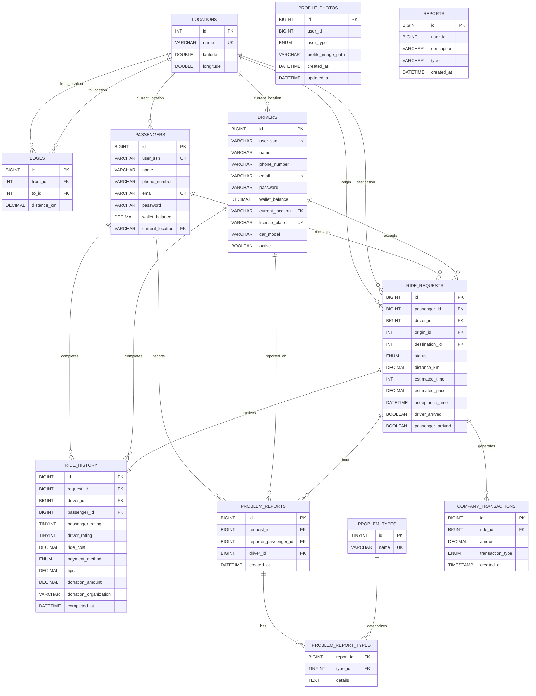

# MiniGo – Ride-Hailing Application

MiniGo is a comprehensive ride-hailing application developed in Java, designed to connect passengers with drivers for efficient and safe transportation. The system provides real-time ride matching, route optimization, payment processing, and a complete ride management workflow.

---

## 📋 Table of Contents

- [Features](#-features)
- [Project Workflow](#-project-workflow)
- [System Architecture](#-system-architecture)
- [Database Design](#-database-design)
- [ER Diagram](#-er-diagram)
- [UML Diagram](#-uml-diagram)
- [Tools & Technologies](#-tools--technologies)
- [Usage](#-usage)
- [Project Structure](#-project-structure)

---

## ✨ Features

### Passenger Features
- **User Registration & Authentication** – Secure account creation and login system
- **Real-time Ride Requests** – Request rides with origin and destination selection
- **Interactive Map View** – Visual representation of locations and routes using OpenLayers
- **Route Optimization** – Shortest path calculation using Dijkstra's algorithm
- **Digital Wallet** – Manage wallet balance and add funds for ride payments
- **Ride History** – View completed rides with detailed information
- **Driver Rating System** – Rate drivers after each ride to maintain quality
- **Live Chat** – Communicate with drivers during rides
- **Problem Reporting** – Report issues with rides or drivers
- **PDF Invoice Generation** – Automatic invoice generation for completed rides
- **Profile Management** – Update personal information and profile photos

### Driver Features
- **Driver Dashboard** – Overview of ride requests and earnings
- **Ride Acceptance System** – Accept or decline ride requests
- **Real-time Navigation** – Interactive map showing pickup and drop-off locations
- **Earnings Tracking** – Monitor income from completed rides
- **Passenger Rating** – Rate passengers after ride completion
- **Profile & Vehicle Management** – Manage driver and vehicle information
- **Status Control** – Toggle availability status (active/inactive)

### System Features
- **Concurrent Request Handling** – Multithreading support for multiple simultaneous ride requests
- **Email Notifications** – Automated email service for important events and confirmations
- **Donation System** – Optional charitable contributions during payment
- **Tips System** – Passengers can tip drivers for excellent service
- **Transaction Management** – Complete financial transaction tracking for the company
- **Problem Type Classification** – Structured reporting system with predefined problem categories

---

## 🔄 Project Workflow

MiniGo follows a complete ride lifecycle from request to completion. Here's how the system operates:

### **1. Passenger Requests a Ride**
- Passenger logs into the application
- Selects origin and destination from available locations
- System displays the selected route on an interactive map

### **2. Route Calculation (Dijkstra's Algorithm)**
- The system models locations as a weighted graph (nodes = locations, edges = roads)
- Dijkstra's shortest path algorithm calculates the optimal route
- Estimated distance, travel time, and fare are computed
- Route visualization is displayed to the passenger

### **3. Ride Request Creation**
- A new ride request is created with status "Pending"
- Request details are saved to the database (`ride_requests` table)
- The request becomes available to active drivers in the system

### **4. Driver Assignment**
- Active drivers receive notifications of pending ride requests
- A driver reviews the request details (pickup location, destination, fare)
- Driver accepts the ride request

### **5. Ride Acceptance & Notification**
- Ride status changes from "Pending" to "Accepted"
- Passenger receives notification with driver information (name, vehicle details)
- Email confirmation is sent to the passenger
- Both parties can access a live chat for communication

### **6. Pickup Process**
- Driver navigates to the passenger's location using the map interface
- Driver marks arrival at pickup location
- Passenger confirms boarding
- Ride officially begins

### **7. Journey in Progress**
- Real-time tracking is available for both passenger and driver
- Live chat remains active for communication
- Driver follows the calculated route to the destination

### **8. Ride Completion**
- Driver arrives at the destination
- Driver marks the ride as completed
- System records completion timestamp

### **9. Payment Processing**
- Ride cost is automatically deducted from passenger's digital wallet
- Driver's wallet balance is credited with the fare amount
- Company transaction fee is recorded in `company_transactions` table
- Transaction details are stored for auditing

### **10. Rating & Feedback**
- Passenger rates the driver (1-5 stars)
- Driver rates the passenger (1-5 stars)
- Optional: Passenger can add a tip for the driver
- Optional: Passenger can donate to a charitable organization
- Ratings are saved to `ride_history` table

### **11. Invoice Generation**
- System automatically generates a PDF invoice using iText library
- Invoice includes ride details, fare breakdown, payment method, tips, and donations
- Invoice is saved to `resources/invoices/` directory
- Email notification with ride summary is sent to the passenger

### **12. Post-Ride Options**
- Passenger can view ride history and download past invoices
- Passenger can report problems with the ride or driver
- Both users can update their profiles and settings

### **Error Handling & Edge Cases**
- **Ride Cancellation**: Passenger can cancel before driver acceptance (cancellation fee may apply)
- **Driver Unavailability**: If no driver accepts within a timeframe, request expires
- **Payment Failure**: Ride cannot be requested if wallet balance is insufficient
- **Problem Reporting**: Structured reporting system for ride issues

This workflow ensures a smooth, transparent, and reliable ride-hailing experience for all users.

---

## 🏗 System Architecture

MiniGo implements a **layered MVC (Model-View-Controller) architecture** with clear separation between presentation, business logic, and data access layers.

### **Architecture Overview**

```
┌─────────────────────────────────────────────────────┐
│                  PRESENTATION LAYER                  │
│              (JavaFX Views + Controllers)            │
│  - Login, Registration, Map, Dashboard, Settings    │
└─────────────────────┬───────────────────────────────┘
                      │
                      ↓
┌─────────────────────────────────────────────────────┐
│                  SERVICE LAYER                       │
│              (Business Logic & Algorithms)           │
│  - RideManager, MapGraph, Payment, Request          │
└─────────────────────┬───────────────────────────────┘
                      │
                      ↓
┌─────────────────────────────────────────────────────┐
│                    DAO LAYER                         │
│            (Data Access Abstraction)                 │
│  - PassengerDAO, DriverDAO, RideRequestDAO, etc.    │
└─────────────────────┬───────────────────────────────┘
                      │
                      ↓
┌─────────────────────────────────────────────────────┐
│                  DATABASE LAYER                      │
│                  (MySQL Database)                    │
│  - Tables: passengers, drivers, ride_requests, etc. │
└─────────────────────────────────────────────────────┘
```

### **Layer Responsibilities**

#### **1. Presentation Layer (View + Controller)**

**View (FXML Files)**
- Define the UI structure declaratively
- Located in `resources/` directory
- Styled using CSS for consistent branding
- Examples: `MapView.fxml`, login screens, dashboards

**Controller (Controller Classes)**
- Handle user interactions and UI events
- Validate user input before processing
- Invoke service layer methods
- Update UI based on operation results
- Examples: `MapController.java`, `LoginController.java`, `DriverDashboardController.java`

**Key Principle**: Controllers never directly access the database. They communicate only with the Service layer.

#### **2. Service Layer (Business Logic)**

This layer contains the core business logic and algorithms:

**RideManager.java**
- Orchestrates the complete ride lifecycle
- Coordinates between multiple DAOs
- Implements ride request matching logic
- Manages concurrent ride requests using multithreading

**MapGraph.java**
- Builds the location graph from database data
- Implements Dijkstra's shortest path algorithm
- Calculates optimal routes between locations
- Computes distance, time, and fare estimates

**Payment.java**
- Handles wallet transactions
- Validates sufficient balance before rides
- Processes fare deductions and credits
- Records company transaction fees

**Request.java**
- Manages ride request state transitions
- Validates ride request data
- Coordinates driver assignment
- Handles ride cancellation logic

**Key Principle**: Service classes encapsulate business rules and coordinate between multiple data sources.

#### **3. DAO Layer (Data Access Object)**

The DAO pattern abstracts all database interactions:

**Purpose**:
- Provide a clean interface for database operations
- Encapsulate SQL queries and JDBC logic
- Prevent SQL injection using prepared statements
- Enable easy database migration or testing with mock data

**DAO Classes**:
- `PassengerDAO.java` – CRUD operations for passengers
- `DriverDAO.java` – CRUD operations for drivers
- `RideRequestDAO.java` – Ride request management
- `RideHistoryDAO.java` – Completed ride records
- `LocationDAO.java` – Location and map data
- `EdgeDAO.java` – Road graph edges
- `ProfilePhotoDAO.java` – User profile images

**Example DAO Method**:
```java
// Abstraction: Controllers/Services call this method
public Passenger findByEmail(String email);

// Implementation: DAO handles SQL internally
// Uses prepared statements to prevent SQL injection
```

**Key Principle**: DAOs are the only classes that contain SQL queries and database connection logic.

#### **4. Model Layer (Data Entities)**

Plain Java objects representing business entities:
- `Passenger.java`, `Driver.java` – User data models
- `RideHistory.java`, `Request.java` – Ride information
- `Location.java`, `Edge.java` – Map graph entities
- `ProblemReport.java`, `Report.java` – Issue tracking

These classes contain fields, getters, setters, and basic validation logic.

### **Data Flow Example: Requesting a Ride**

1. **User Action**: Passenger selects origin/destination and clicks "Request Ride"
2. **Controller**: `MapController` validates input (non-null locations, sufficient wallet balance)
3. **Service Layer**: 
   - `MapGraph.calculateShortestPath()` computes optimal route
   - `Payment.validateBalance()` checks if passenger can afford the ride
   - `RideManager.createRideRequest()` orchestrates request creation
4. **DAO Layer**: 
   - `RideRequestDAO.insert()` saves request to database
   - `PassengerDAO.updateWalletBalance()` reserves funds (if needed)
5. **Notification**: Email service sends confirmation to passenger
6. **Response**: Controller receives success/failure result and updates UI

### **Architecture Benefits**

✅ **Separation of Concerns**: Each layer has a single, well-defined responsibility  
✅ **Maintainability**: Changes in one layer don't cascade to others  
✅ **Testability**: Layers can be unit tested independently with mock objects  
✅ **Scalability**: New features integrate cleanly without modifying core architecture  
✅ **Reusability**: Business logic is decoupled from UI and can be reused  
✅ **Security**: SQL injection prevention through DAO prepared statements

---

## 🗄 Database Design


The MiniGo database uses a **relational schema** designed to efficiently manage users, rides, locations, and transactions. The database ensures data integrity through foreign key constraints and supports complex queries for real-time ride matching and reporting.

### **Core Entities**

#### **Locations Table**
Stores all available locations (cities, landmarks, areas) with geographic coordinates. Acts as nodes in the map graph.
- **Primary Key**: `id`
- **Unique Constraint**: `name` (location names must be unique)
- **Attributes**: `name`, `latitude`, `longitude`

#### **Edges Table**
Represents road connections between locations, forming a weighted graph for route calculation.
- **Primary Key**: `id`
- **Foreign Keys**: `from_id`, `to_id` (reference `locations.id`)
- **Attributes**: `distance_km` (weight for Dijkstra's algorithm)

#### **Passengers Table**
Stores passenger account information and current state.
- **Primary Key**: `id`
- **Unique Constraints**: `user_ssn`, `email`
- **Foreign Key**: `current_location` (references `locations.name`)
- **Attributes**: `name`, `phone_number`, `email`, `password`, `wallet_balance`

#### **Drivers Table**
Stores driver account information, vehicle details, and availability status.
- **Primary Key**: `id`
- **Unique Constraints**: `user_ssn`, `license_plate`
- **Foreign Key**: `current_location` (references `locations.name`)
- **Attributes**: `name`, `phone_number`, `email`, `password`, `wallet_balance`, `car_model`, `active`

#### **Ride Requests Table**
Tracks all ride requests from creation to completion or cancellation.
- **Primary Key**: `id`
- **Foreign Keys**: 
  - `passenger_id` → `passengers(id)`
  - `driver_id` → `drivers(id)` (nullable until assigned)
  - `origin_id` → `locations(id)`
  - `destination_id` → `locations(id)`
- **Attributes**: `status`, `distance_km`, `estimated_time`, `estimated_price`, `acceptance_time`
- **Status Values**: 'Pending', 'Accepted', 'Cancelled', 'Completed'

#### **Ride History Table**
Archives completed rides with ratings, payment details, and optional tips/donations.
- **Primary Key**: `id`
- **Foreign Keys**: 
  - `request_id` → `ride_requests(id)`
  - `driver_id` → `drivers(id)`
  - `passenger_id` → `passengers(id)`
- **Attributes**: `passenger_rating`, `driver_rating`, `ride_cost`, `payment_method`, `tips`, `donation_amount`, `completed_at`

#### **Problem Reports Tables**
Two-table structure for flexible problem reporting:
- **problem_types**: Defines predefined problem categories (DRIVER_BEHAVIOR, RECKLESS_DRIVING, etc.)
- **problem_reports**: Main report record
- **problem_report_types**: Many-to-many relationship allowing multiple problem types per report

#### **Company Transactions Table**
Tracks all financial transactions for business analytics and accounting.
- **Primary Key**: `id`
- **Foreign Key**: `ride_id`
- **Attributes**: `amount`, `transaction_type`, `created_at`
- **Transaction Types**: 'COMPLETED', 'CANCELLED_BY_PASSENGER'

#### **Profile Photos Table**
Stores profile image paths separately to avoid NULL values in main user tables.
- **Primary Key**: `id`
- **Unique Constraint**: `(user_id, user_type)`
- **Attributes**: `user_id`, `user_type` (enum: 'passenger', 'driver'), `profile_image_path`

#### **Reports Table**
Stores general app issue reports from users.
- **Primary Key**: `id`
- **Attributes**: `user_id`, `description`, `type`, `created_at`

### **Key Relationships**

- **Passengers ↔ Locations**: Many-to-One (a passenger has one current location)
- **Drivers ↔ Locations**: Many-to-One (a driver has one current location)
- **Ride Requests ↔ Passengers**: Many-to-One (a passenger can have multiple requests)
- **Ride Requests ↔ Drivers**: Many-to-One (a driver can accept multiple requests)
- **Ride Requests ↔ Locations**: Two Many-to-One relationships (origin and destination)
- **Ride History ↔ Ride Requests**: One-to-One (each completed ride has one history record)
- **Problem Reports ↔ Problem Types**: Many-to-Many (a report can have multiple problem types)
- **Edges ↔ Locations**: Two Many-to-One relationships (forming a directed graph)

### **Referential Integrity**

The database enforces referential integrity through:
- **CASCADE updates**: When location names change, references are automatically updated
- **SET NULL on delete**: If a location is deleted, user current_location fields are set to NULL
- **Cascade delete**: Deleting a problem report removes associated problem_report_types entries
- **Check constraints**: Ensures valid ranges for ratings (0-5) and positive distances

---

## 📊 ER Diagram



### **Relationship Summary**

| Relationship | Cardinality | Description |
|-------------|-------------|-------------|
| **Location → Edges** | 1:N | One location connects to many roads |
| **Location → Passengers** | 1:N | Multiple passengers can be at one location |
| **Location → Drivers** | 1:N | Multiple drivers can be at one location |
| **Passenger → Ride Requests** | 1:N | One passenger can make multiple ride requests |
| **Driver → Ride Requests** | 1:N | One driver can accept multiple ride requests |
| **Ride Request → Ride History** | 1:1 | Each completed ride has exactly one history record |
| **Passenger → Ride History** | 1:N | One passenger has multiple ride history entries |
| **Driver → Ride History** | 1:N | One driver has multiple ride history entries |
| **Problem Report → Problem Types** | N:M | A report can have multiple problem types, and each type can appear in multiple reports |
| **Ride Request → Company Transactions** | 1:N | Each ride can generate multiple transaction records |

---

## 🎨 UML Diagram

The UML (Unified Modeling Language) class diagram provides a visual representation of the system's object-oriented structure, showing the relationships between classes, their attributes, and methods.


### **What the UML Represents**

The UML diagram illustrates:

- **Core Classes**: `Passenger`, `Driver`, `RideRequest`, `RideHistory`, `Location`, `Edge`
- **Inheritance Relationships**: Both `Passenger` and `Driver` inherit from a common `Person` class
- **Composition & Aggregation**: How objects are connected (e.g., `RideRequest` contains references to `Passenger`, `Driver`, and `Location`)
- **Class Attributes**: Data fields for each entity
- **Class Methods**: Key operations like `requestRide()`, `acceptRide()`, `calculateShortestPath()`
- **Enumerations**: `Status` (Pending, Accepted, Completed), `PaymentType`, `ProblemType`

The diagram follows standard UML notation and helps visualize the system's architecture before implementation, ensuring proper design and maintainability.

---

## 🛠 Tools & Technologies

### **Java**
The core programming language for the entire application. Java provides strong object-oriented programming capabilities, platform independence, and robust performance for building enterprise-level applications. Its mature ecosystem and extensive libraries make it ideal for complex systems like MiniGo.

### **JavaFX**
Used for building the graphical user interface (GUI). JavaFX provides modern UI components, CSS styling support, and FXML for declarative UI design, enabling a clean separation between UI and logic. The framework's event-driven architecture makes it perfect for responsive, interactive applications.

### **MySQL**
The relational database management system used for persistent data storage. MySQL ensures data integrity through foreign key constraints, supports complex queries, and provides reliable transaction management. Its ACID compliance guarantees consistency for critical operations like payment processing and ride management.

### **MVC Architecture (Model-View-Controller)**
The project follows the MVC design pattern to separate concerns:
- **Model**: Data entities and business logic (`Driver`, `Passenger`, `RideRequest`, etc.)
- **View**: FXML files and JavaFX UI components
- **Controller**: Handles user interactions and coordinates between Model and View

This separation improves code maintainability, testability, and allows parallel development of UI and business logic.

### **DAO Pattern (Data Access Object)**
Implemented to abstract and encapsulate all database access operations. The DAO pattern provides a clean separation between the business logic and data access layer, making the codebase more maintainable and testable. It allows easy database switching without affecting business logic.

### **OpenLayers**
A JavaScript library integrated via WebView to display interactive maps. OpenLayers provides map rendering, marker placement, and route visualization, enabling users to see locations and planned routes visually. Its open-source nature and extensive documentation make it perfect for custom map implementations.

### **Dijkstra's Algorithm**
Implemented for finding the shortest path between two locations on the map graph. This algorithm ensures optimal route calculation, minimizing travel distance and providing accurate fare estimates. The algorithm treats the road network as a weighted graph where locations are nodes and roads are edges with distance weights.

### **Multithreading**
Java's multithreading capabilities are used to handle concurrent ride requests, real-time updates, and background tasks without blocking the user interface. This ensures a responsive application experience even when multiple passengers and drivers are using the system simultaneously.

### **Email Service (JavaMail API)**
Integrated to send automated email notifications for:
- Account registration confirmations
- Ride completion receipts
- Password reset requests
- Important system notifications

Libraries used:
- `mail-1.4.7.jar` – JavaMail API for SMTP communication
- `activation-1.1.1.jar` – JavaBeans Activation Framework for handling email content types

The email service provides professional communication and keeps users informed throughout the ride lifecycle.

### **HTML & CSS**
Used for:
- **Email Templates**: Creating professional, styled email notifications with consistent branding
- **PDF Invoices**: Generating well-formatted ride receipts with Uber-style dark theme
- **Embedded Web Views**: Styling the map view interface for a modern look

HTML provides structure while CSS ensures consistent, attractive styling across all generated content.

### **iText PDF (v5.5.13.3)**
A powerful library for generating PDF documents. Used to create professional, styled invoices for completed rides with detailed fare breakdowns, payment information, and company branding. The library allows programmatic creation of complex PDF layouts with tables, images, and custom fonts.


---

## 🚀 Usage

### For Passengers

1. **Register**: Create a new account with personal information
2. **Login**: Access your account with email and password
3. **Add Funds**: Load money into your digital wallet
4. **Request Ride**: Select origin and destination, view route and fare estimate
5. **Wait for Driver**: A nearby available driver will accept your request
6. **Track Ride**: View the driver's location and chat if needed
7. **Complete Ride**: Arrive at your destination and rate the driver
8. **View Invoice**: Download or view the PDF invoice for your ride

### For Drivers

1. **Register as Driver**: Create a driver account with vehicle information
2. **Login**: Access the driver dashboard
3. **Set Status**: Toggle your availability (active/inactive)
4. **Accept Requests**: View incoming ride requests and accept them
5. **Navigate**: Use the map to reach the passenger's location
6. **Start Ride**: Confirm passenger pickup and begin the journey
7. **Complete Ride**: End the ride at the destination and rate the passenger
8. **Track Earnings**: Monitor your income and wallet balance

---

## 📂 Project Structure

```
Mini_Uber_Java_Project/
│
├── src/
│   ├── Main.java                    # Application entry point
│   ├── controller/                  # JavaFX controllers (UI logic)
│   ├── Model/                       # Data models and entities
│   ├── DAO/                         # Database access objects
│   ├── services/                    # Business logic layer
│   ├── utils/                       # Utility classes (InvoiceGenerator, etc.)
│   └── view/                        # FXML view files
│
├── resources/                       # Application resources
│   ├── *.fxml                       # JavaFX view definitions
│   ├── *.css                        # Stylesheets
│   ├── *.png                        # Images and icons
│   ├── map.html                     # OpenLayers map interface
│   ├── invoices/                    # Generated PDF invoices
│   └── profile_images/              # User profile photos
│
├── libs/                            # External JAR libraries
│   ├── itextpdf-5.5.13.3.jar
│   ├── mail-1.4.7.jar
│   └── activation-1.1.1.jar
│
├── sql_file/
│   └── MiniGo.sql                   # Database schema and initial data
│
├── uml design/
│   └── Updated_design.jpg           # UML diagrams
│
└── README.md                        # Project documentation
```

---


**MiniGo** – Connecting passengers and drivers, one ride at a time. 🚗✨

